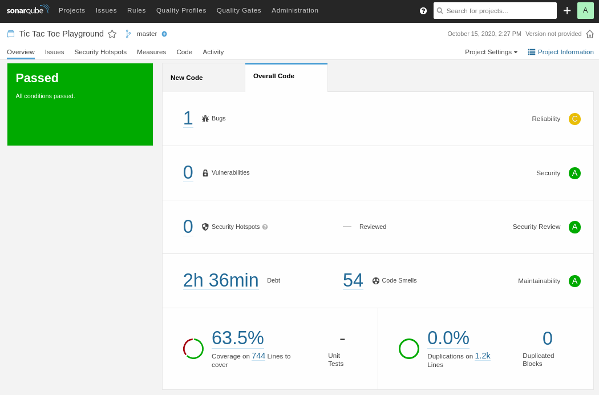

# SonarQube CSharp

This guide is based on the project [Tic Tac Toe Playground](https://github.com/willianantunes/tic-tac-toe-csharp-playground), thus you can use it right way to follow the steps described here.

## AD-HOC running

Just issue at the root folder as I'm using volumes here:

    docker run -d --rm --name sonarqube \
    -v "$(pwd)/plugins":/opt/sonarqube/extensions/plugins/ \
    -e SONAR_ES_BOOTSTRAP_CHECKS_DISABLE=true \
    -p 9000:9000 \
    sonarqube:8.5-community

Now access `http://localhost:9000` and log in with the classical `admin/admin` credential.

### Reading your project

When SonarQube tool is fully up and running, on [Projects](http://localhost:9000/projects) page, click on `Create a new project` button. Fill like the following but change to match your needs:

- **Project Key**: tic-tac-toe-playground 
- **Display name**: Tic Tac Toe Playground

Now click on `Set Up`. Generate a new token but first give it a name, like `personal-token-jafar` and accept that (if it was a CI/CD guy, `service-token-azure-devops` is a good catch). Copy the generated token! We're gonna use it as a way to login, my case it was `9299d771660da9ea8cbf8cf3c67552b65395b970`, now click on `Continue`.

At this stage we enabled SonarQube to accept incoming inputs to this project. In order to do that, first install the following binary globally:

    dotnet tool install --global dotnet-sonarscanner

At the root folder of your project, execute the command below (the order is important here): 

    dotnet sonarscanner begin /k:"tic-tac-toe-playground" \
    /d:sonar.host.url="http://localhost:9000" \
    /d:sonar.login="9299d771660da9ea8cbf8cf3c67552b65395b970" \
    /d:sonar.cs.opencover.reportsPaths="**/*/coverage.opencover.xml"

Now build your project:

    dotnet build

Run your tests if needed (I have a [custom configuration file](https://github.com/willianantunes/tic-tac-toe-csharp-playground/blob/master/runsetting.xml) for Coverlet):

    dotnet test --settings runsetting.xml

And at last let's end the `sonarscanner` session:

    dotnet sonarscanner end /d:sonar.login=9299d771660da9ea8cbf8cf3c67552b65395b970

Now on your [project's dashboard](http://localhost:9000/dashboard?id=tic-tac-toe-playground) you'll see something like:  

## Interesting links

- [SonarQube Docker Official Image](https://hub.docker.com/_/sonarqube)
- [SonarQube 2 minutes get started](https://docs.sonarqube.org/8.5/setup/get-started-2-minutes/)
- [SonarQube Marketplace](https://www.sonarplugins.com/)
- [SonarScanner for MSBuild](https://docs.sonarqube.org/latest/analysis/scan/sonarscanner-for-msbuild/)
- [Test Coverage & Execution](https://docs.sonarqube.org/latest/analysis/coverage/)